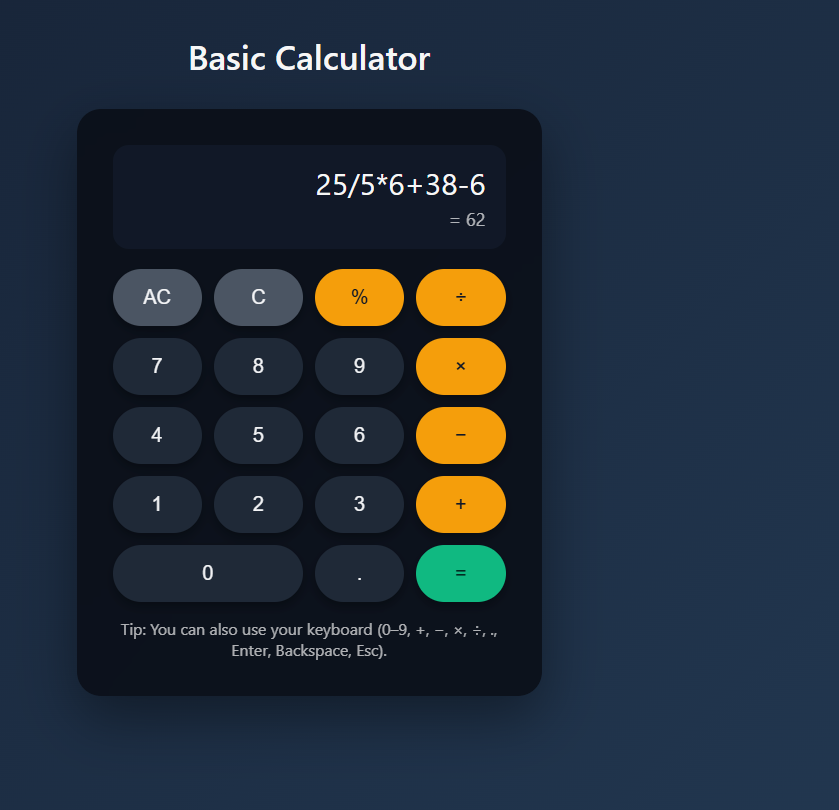

# 🧮 Basic Calculator — CodeAlpha Internship

  
  
  
  

---

## 🚀 Live Demo

  

---

## 📌 Project Overview
This project is developed for the **CodeAlpha Frontend Development Internship — Task 2: Build a Basic Calculator**.

The calculator performs essential arithmetic operations with a clean, user-friendly UI. It includes keyboard support, responsive layout, and smooth interactions. This project aligns with the official task requirements.

---

## 🎬 GIF Demo

  

*This GIF shows a quick demonstration of the calculator functioning in real time.*

---

## ✨ Features

### 🔢 Basic Functionalities
- Addition (+)
- Subtraction (−)
- Multiplication (×)
- Division (÷)
- Decimal number support
- Clear (C) and All Clear (AC)

---

### ⌨️ Keyboard Support

| Key | Function |
|------|----------|
| 0–9 | Enter numbers |
| + - * / | Operators |
| . | Decimal |
| Enter | Calculate |
| Backspace | Delete last character |
| Escape | Clear all |

---

### 🎨 UI & Experience
- Clean, modern interface  
- Smooth hover and press animations  
- Responsive grid layout  
- Easy to use on both desktop and mobile  

---

## 🖼️ Screenshot

---

## 🚀 How to Run

1. Download or clone this repository.  
2. Open **index.html** in a browser.  
3. Start using the calculator with buttons or keyboard inputs.

---

## 🛠️ Technologies Used

- **HTML5** — Structure  
- **CSS3** — Styling & responsiveness  
- **JavaScript (ES6)** — Functional logic + input handling  

---

## 👨‍💻 Developer

### **Vemula Vamshi Krishna**  
Frontend Developer — CodeAlpha Intern  

🔗 LinkedIn:  
https://www.linkedin.com/in/vamsi-krishna-9a9090271/

---

## ✅ Status  
✔ Completed — Successfully submitted for CodeAlpha Internship Task 2  
