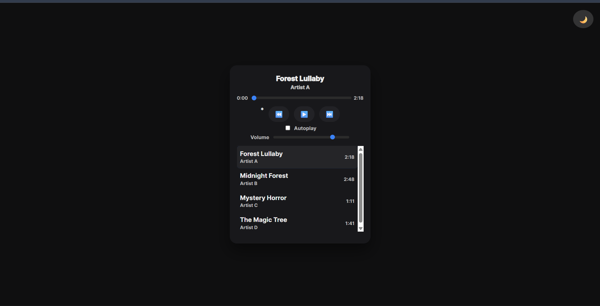

# 🎵 Music Player — CodeAlpha Internship

  
  
  
  

## 🚀 Live Demo

  

## 📌 Project Overview
This Music Player was built for the **CodeAlpha Frontend Development Internship — Task 4**.  
It includes playlist handling, song durations, autoplay, theme switching, volume control, and a clean modern UI.

## 🎬 GIF Demo

  

## ✨ Features

### 🎧 Complete Audio Controls
- Play / Pause music  
- Next / Previous track  
- Time tracking + scrubbing  
- Updates play/pause icons dynamically  

### 📝 Playlist System
- Automatically generated playlist  
- Click any song to play  
- Highlights active song  
- Displays song title, artist, and duration  

### 📀 Song Duration Preloading
- Loads metadata in background  
- Updates playlist durations automatically  

### 🔊 Volume Control
- Smooth volume slider  
- Default volume = 80%  

### 🔁 Autoplay Mode
- Plays next track automatically  
- Disabled mode stops music at end  

### 🌓 Theme Toggle
- Light & Dark theme  
- Floating top-right button  
- Icon updates (🌙 / ☀️)  

### ⌨️ Keyboard Support
- Spacebar → Play/Pause  

### 📱 Responsive Design
- Centered layout  
- Works on all screen sizes  

## 🖼️ Screenshot

  

## 🚀 How to Run
1. Download or clone the repository.  
2. Ensure `songs/` and `output/` folders are in correct structure.  
3. Open **index.html** in any browser.  

## 🛠️ Technologies Used
- **HTML5**  
- **CSS3**  
- **JavaScript (ES6)**  

## 👨‍💻 Developer
**Vemula Vamshi Krishna**  
Frontend Developer — CodeAlpha Intern  
LinkedIn: https://www.linkedin.com/in/vamsi-krishna-9a9090271/

## ✅ Status
✔ Completed — Successfully submitted for CodeAlpha Internship Task 4
